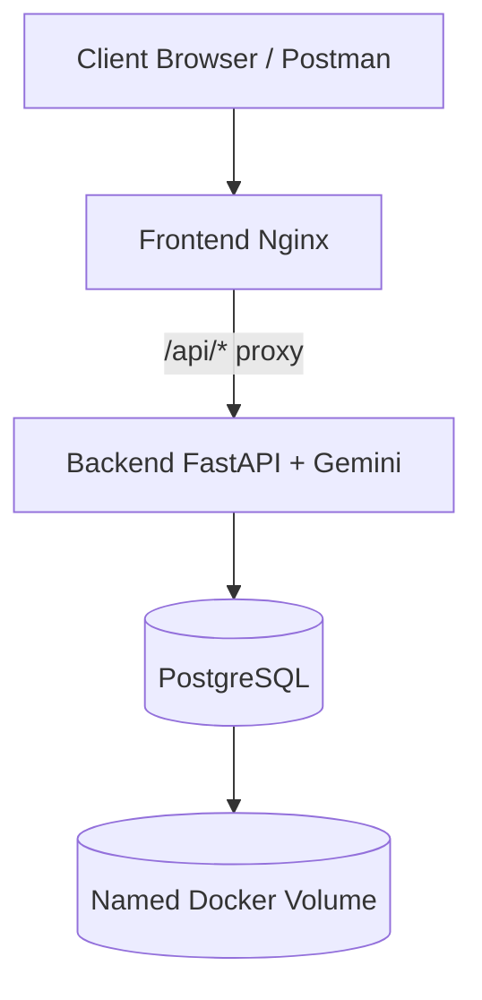

# Gemini Image Analyzer

Production-style containerized image analysis application using FastAPI, Gemini API, PostgreSQL, Docker Compose, and LAN networking (`macvlan` or `ipvlan`).

## Table of Contents

- [Overview](#overview)
- [System Architecture](#system-architecture)
- [Tech Stack](#tech-stack)
- [Project Structure](#project-structure)
- [Prerequisites](#prerequisites)
- [Configuration](#configuration)
- [Networking: macvlan vs ipvlan](#networking-macvlan-vs-ipvlan)
- [Quick Start](#quick-start)
- [Access Modes](#access-modes)
- [API Reference](#api-reference)
- [Proof and Validation Checklist](#proof-and-validation-checklist)
- [Troubleshooting](#troubleshooting)
- [Security Notes](#security-notes)

## Overview

This project demonstrates:

- A backend API that analyzes images using Gemini and stores results.
- A PostgreSQL database with persistent storage via named Docker volume.
- A frontend served by Nginx, with proxying to backend API endpoints.
- A LAN-mode deployment using an external Docker network with static IPs.
- A localhost testing path for same-machine testing reliability.

Repository reference: [Project Assignment 1](https://github.com/sainisourab/containerization-and-devops-labb/tree/main/Project%20Assignment%201)

## System Architecture



Deployment network model:

- `frontend`, `backend`, and `database` join external `lan_net` using static IPs.
- `frontend_local` stays on bridge network and publishes a host port (`8088` by default).
- `backend` is dual-homed (`app_net` + `lan_net`) so LAN and local frontend paths both work.

## Tech Stack

- Frontend: HTML + JavaScript + Nginx
- Backend: FastAPI + asyncpg + Gemini API
- Database: PostgreSQL (custom Docker image)
- Container Orchestration: Docker Compose
- Networking: external `macvlan` or `ipvlan`

## Project Structure

```text
.
├── backend/
│   ├── app/
│   │   ├── config.py
│   │   ├── database.py
│   │   ├── gemini_service.py
│   │   ├── main.py
│   │   └── schemas.py
│   ├── Dockerfile
│   └── requirements.txt
├── database/
│   ├── init/01-bootstrap.sql
│   └── Dockerfile
├── frontend/
│   ├── Dockerfile
│   ├── index.html
│   └── nginx.conf
├── docs/
│   └── PROOF_STEPS.md
├── docker-compose.yml
├── .env.example
├── NETWORK_COMMANDS.md
└── REPORT.md
```

## Prerequisites

Before running the stack, ensure:

- Docker Desktop / Docker Engine is installed and running.
- Docker Compose v2 is available (`docker compose version`).
- A valid Gemini API key is available.
- Your LAN subnet and gateway are known (for static IP planning).

## Configuration

1. Create environment file:

```bash
cp .env.example .env
```

2. Update these keys in `.env`:

- `DOCKER_LAN_NETWORK` (name of external network to create)
- `BACKEND_STATIC_IP`, `DB_STATIC_IP`, `FRONTEND_STATIC_IP` (must be in subnet and unused)
- `FRONTEND_HOST_PORT` (default `8088`)
- `POSTGRES_DB`, `POSTGRES_USER`, `POSTGRES_PASSWORD`
- `GEMINI_API_KEY`, `GEMINI_MODEL`

3. Make sure selected IPs do not conflict with DHCP or existing LAN devices.

## Networking: macvlan vs ipvlan

### `macvlan` vs `ipvlan` (conceptual difference)

| Parameter | macvlan | ipvlan |
|---|---|---|
| L2 identity | Each container gets its own MAC address | Containers reuse parent interface MAC (driver-level multiplexing) |
| Broadcast domain behavior | Container appears like a separate physical LAN host | More interface-efficient with fewer exposed MAC identities |
| Typical assignment demos | Very popular for "container as LAN host" demonstrations | Often chosen where MAC scaling or switch policies matter |
| Host to container access | Common host-isolation caveat on same machine | Can be easier in some setups, but depends on mode/config |

### Why `macvlan` is chosen in this project

`macvlan` is selected as the primary recommendation for assignment demonstration because:

- It clearly shows each container as a first-class LAN endpoint with static IP identity.
- It maps well to the assignment requirement of demonstrating custom networking and LAN reachability.
- It is straightforward to explain and verify using `docker network inspect` and container IP checks.

`ipvlan` is still supported as an alternate mode and can be used where local environment constraints make it preferable.

### macvlan host isolation workaround

In many environments, the Docker host cannot directly access containers on the same `macvlan` network. This is expected behavior in common `macvlan` setups.

This project provides a practical workaround:

1. Keep LAN-facing services on `lan_net` (`macvlan`).
2. Run `frontend_local` on bridge network.
3. Expose `frontend_local` via host port (`http://localhost:8088` by default).

This gives both:

- LAN demonstration path via static IP (`http://<FRONTEND_STATIC_IP>`)
- Reliable same-host testing path via localhost

Optional advanced workaround (host-side `macvlan` shim):

- Create a host `macvlan` interface attached to the same parent NIC.
- Assign an IP in the same subnet.
- Add routing rules to reach container IP range through that shim.

Note: exact commands differ by OS and host networking model. For this assignment repository, the recommended and portable workaround remains `frontend_local` on localhost.

## Quick Start

### 1) Create external network (mandatory)

Use one mode from `NETWORK_COMMANDS.md`:

- Option A: `macvlan` (recommended)
- Option B: `ipvlan` (alternative)

### 2) Build and start all services

```bash
docker compose up --build -d
```

### 3) Verify status and health

```bash
docker compose ps
docker compose logs backend --tail=50
docker compose logs frontend frontend_local --tail=50
docker compose logs database --tail=50
```

## Access Modes

| Use Case | URL | Notes |
|---|---|---|
| LAN access (assignment proof) | `http://<FRONTEND_STATIC_IP>` | Uses external LAN network |
| Same host/laptop access | `http://localhost:<FRONTEND_HOST_PORT>` | Uses `frontend_local` |
| Backend health check | `http://<BACKEND_STATIC_IP>:8000/health` | Validates API + DB + Gemini config |

Default host port is `8088` unless changed in `.env`.

## API Reference

### `GET /health`

```bash
curl http://<BACKEND_STATIC_IP>:8000/health
```

### `POST /records`

Stores analyzed result into PostgreSQL.

Request with image URL:

```json
{
  "image_url": "https://images.unsplash.com/photo-1470071459604-3b5ec3a7fe05",
  "reference_text": "A landscape image likely showing nature."
}
```

Request with base64:

```json
{
  "image_base64": "data:image/png;base64,iVBORw0KGgoAAAANSUhEUgAA...",
  "reference_text": "Check if this looks like a product photo."
}
```

Example:

```bash
curl -X POST http://<BACKEND_STATIC_IP>:8000/records \
  -H "Content-Type: application/json" \
  -d "{\"image_url\":\"https://images.unsplash.com/photo-1470071459604-3b5ec3a7fe05\",\"reference_text\":\"Nature scene\"}"
```

### `GET /records?limit=<n>`

```bash
curl "http://<BACKEND_STATIC_IP>:8000/records?limit=10"
```

## Proof and Validation Checklist

Use these commands for screenshots/evidence:

```bash
docker network inspect <network-name>
docker inspect -f "{{.Name}} -> {{range .NetworkSettings.Networks}}{{.IPAddress}}{{end}}" image-analyzer-frontend image-analyzer-api image-analyzer-db
docker compose ps
```

Persistence validation flow:

1. Call `POST /records` to insert data.
2. Stop stack: `docker compose down`
3. Restart stack: `docker compose up -d`
4. Call `GET /records`
5. Confirm older records still exist (named volume persistence).

Detailed checklist: `docs/PROOF_STEPS.md`

## Troubleshooting

- `413 Request Entity Too Large`
  - Configure `client_max_body_size` in `frontend/nginx.conf`.
- Cannot open static frontend IP from same host
  - Typical `macvlan` host-isolation; use `http://localhost:<FRONTEND_HOST_PORT>`.
- Static IP assignment fails
  - Ensure IPs are within subnet and currently unused.
- External network missing
  - Create external network first (`macvlan` or `ipvlan`) before `docker compose up`.
- Network overlap errors
  - Select a non-overlapping subnet with your existing Docker/host networks.

## Security Notes

- Never commit real API keys into git.
- Keep `.env` private; commit only `.env.example`.
- Rotate `GEMINI_API_KEY` if accidentally exposed.
- Use strong `POSTGRES_PASSWORD` values in non-demo environments.