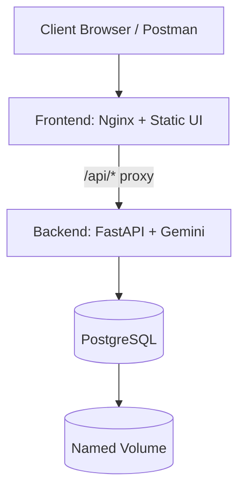

# Gemini Image Analyzer

<p align="left">
  
  
  
  
  
</p>

Containerized AI image analyzer built for **Project Assignment 1** requirements:
- Separate backend and database Dockerfiles
- Docker Compose orchestration
- PostgreSQL with named volume persistence
- External `macvlan`/`ipvlan` networking with static container IPs
- Healthchecks + restart policies

Repository path:
`Project Assignment 1`

---

## Table of Contents

- [Architecture](#architecture)
- [Tech Stack](#tech-stack)
- [Project Structure](#project-structure)
- [Quick Start](#quick-start)
- [Run and Access](#run-and-access)
- [API Endpoints](#api-endpoints)
- [Proof Checklist](#proof-checklist)
- [Troubleshooting](#troubleshooting)
- [Security Notes](#security-notes)

---

## Architecture



Network model:
- `frontend` + `backend` + `database` attach to external LAN network (`macvlan` or `ipvlan`) with static IPs.
- `frontend_local` is exposed on localhost for same-laptop testing.

---

## Tech Stack

- **Frontend:** HTML + JavaScript + Nginx reverse proxy
- **Backend:** FastAPI + asyncpg + Gemini API
- **Database:** PostgreSQL (custom Dockerfile)
- **Containerization:** Docker multi-stage build + Docker Compose
- **Networking:** External `macvlan` or `ipvlan`

---

## Project Structure

```text
.
├── backend/
│   ├── app/
│   │   ├── config.py
│   │   ├── database.py
│   │   ├── gemini_service.py
│   │   ├── main.py
│   │   └── schemas.py
│   ├── .dockerignore
│   ├── Dockerfile
│   └── requirements.txt
├── database/
│   ├── init/01-bootstrap.sql
│   ├── .dockerignore
│   └── Dockerfile
├── frontend/
│   ├── .dockerignore
│   ├── Dockerfile
│   ├── index.html
│   └── nginx.conf
├── docs/
│   └── PROOF_STEPS.md
├── docker-compose.yml
├── .env.example
├── NETWORK_COMMANDS.md
└── REPORT.md
```

---

## Quick Start

### 1) Prepare environment

```bash
cp .env.example .env
```

Set at minimum:
- `GEMINI_API_KEY`
- `DOCKER_LAN_NETWORK`
- `BACKEND_STATIC_IP`, `DB_STATIC_IP`, `FRONTEND_STATIC_IP`
- `FRONTEND_HOST_PORT` (default `8088`)
- `POSTGRES_DB`, `POSTGRES_USER`, `POSTGRES_PASSWORD`

### 2) Create external Docker network (mandatory)

Use one mode from `NETWORK_COMMANDS.md`:
- macvlan (recommended for assignment demonstration)
- ipvlan (alternative)

### 3) Build and start

```bash
docker compose up --build -d
```

### 4) Check status/logs

```bash
docker compose ps
docker compose logs frontend frontend_local --tail=50
docker compose logs backend --tail=50
docker compose logs database --tail=50
```

---

## Run and Access

### Option A: LAN access (assignment requirement)

- Frontend: `http://<FRONTEND_STATIC_IP>`
- Backend health: `http://<BACKEND_STATIC_IP>:8000/health`

### Option B: Same laptop access

- Frontend: `http://localhost:<FRONTEND_HOST_PORT>`

Default `FRONTEND_HOST_PORT` is `8088`.

> Note: with `macvlan`, host-to-container access can fail due to host isolation.  
> Use localhost (`frontend_local`) for same-machine testing.

---

## API Endpoints

### `GET /health`

```bash
curl http://<BACKEND_STATIC_IP>:8000/health
```

### `POST /records` (analyze + persist)

Using image URL:

```json
{
  "image_url": "https://images.unsplash.com/photo-1470071459604-3b5ec3a7fe05",
  "reference_text": "A landscape image likely showing nature."
}
```

Using base64 image:

```json
{
  "image_base64": "data:image/png;base64,iVBORw0KGgoAAAANSUhEUgAA...",
  "reference_text": "Check if this looks like a product photo."
}
```

Example request:

```bash
curl -X POST http://<BACKEND_STATIC_IP>:8000/records \
  -H "Content-Type: application/json" \
  -d "{\"image_url\":\"https://images.unsplash.com/photo-1470071459604-3b5ec3a7fe05\",\"reference_text\":\"Nature scene\"}"
```

### `GET /records?limit=50`

```bash
curl http://<BACKEND_STATIC_IP>:8000/records?limit=10
```

---

## Proof Checklist

Use these commands for screenshots:

```bash
docker network inspect <network-name>
docker inspect -f "{{.Name}} -> {{range .NetworkSettings.Networks}}{{.IPAddress}}{{end}}" image-analyzer-frontend image-analyzer-api image-analyzer-db
docker compose ps
```

Persistence test:
1. Insert record using `POST /records`
2. `docker compose down`
3. `docker compose up -d`
4. `GET /records` shows previous record (named volume persistence)

Detailed checklist: `docs/PROOF_STEPS.md`

---

=