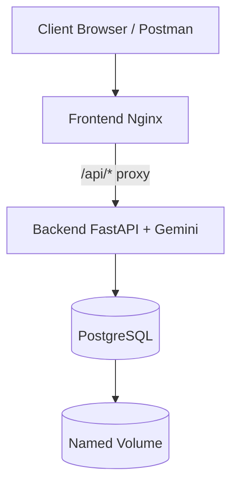

<div align="center">

# Gemini Image Analyzer

Production-style containerized web app for AI image analysis with Gemini, PostgreSQL, Docker Compose, and LAN networking.

<p>
  
  
  
  
  
</p>

<p>
  <a href="#quick-start">Quick Start</a> |
  <a href="#run-and-access">Run and Access</a> |
  <a href="#api-reference">API Reference</a> |
  <a href="#proof-checklist">Proof Checklist</a>
</p>

</div>

---

## Repository

Project path on GitHub:  
[Project Assignment 1](https://github.com/sainisourab/containerization-and-devops-labb/tree/main/Project%20Assignment%201)

---

## Highlights

| Capability | Implementation |
|---|---|
| API + AI | FastAPI backend calling Gemini for image understanding and reference comparison |
| Database | PostgreSQL with table auto-creation and persistent named volume |
| Containerization | Separate Dockerfiles for backend and database with optimized image setup |
| Networking | External `macvlan` or `ipvlan` network with static container IP assignment |
| Reliability | Healthchecks, restart policy, startup dependency ordering in Compose |
| Local Testing | `frontend_local` service exposed on localhost to avoid macvlan host-isolation issues |

---

## Architecture



Network model:
- `frontend`, `backend`, and `database` are attached to the external LAN network (`macvlan` or `ipvlan`) with static IPs.
- `frontend_local` runs on bridge and maps to localhost for same-laptop access.

---

## Tech Stack

- Frontend: HTML + JavaScript + Nginx reverse proxy
- Backend: FastAPI + asyncpg + Gemini API client
- Database: PostgreSQL (custom Dockerfile)
- Orchestration: Docker Compose
- Networking: external macvlan or ipvlan

---

## Project Structure

```text
.
├── backend/
│   ├── app/
│   │   ├── config.py
│   │   ├── database.py
│   │   ├── gemini_service.py
│   │   ├── main.py
│   │   └── schemas.py
│   ├── .dockerignore
│   ├── Dockerfile
│   └── requirements.txt
├── database/
│   ├── init/01-bootstrap.sql
│   ├── .dockerignore
│   └── Dockerfile
├── frontend/
│   ├── .dockerignore
│   ├── Dockerfile
│   ├── index.html
│   └── nginx.conf
├── docs/
│   └── PROOF_STEPS.md
├── docker-compose.yml
├── .env.example
├── NETWORK_COMMANDS.md
└── REPORT.md
```

---

## Quick Start

### 1) Configure environment

```bash
cp .env.example .env
```

Update required keys:
- `GEMINI_API_KEY`
- `DOCKER_LAN_NETWORK`
- `BACKEND_STATIC_IP`, `DB_STATIC_IP`, `FRONTEND_STATIC_IP`
- `FRONTEND_HOST_PORT` (default `8088`)
- `POSTGRES_DB`, `POSTGRES_USER`, `POSTGRES_PASSWORD`

### 2) Create external network (mandatory)

Use commands in `NETWORK_COMMANDS.md` for:
- macvlan (recommended for assignment demonstration)
- ipvlan (alternative)

### 3) Build and run

```bash
docker compose up --build -d
```

### 4) Verify containers

```bash
docker compose ps
docker compose logs frontend frontend_local --tail=50
docker compose logs backend --tail=50
docker compose logs database --tail=50
```

---

## Run and Access

| Mode | URL | Notes |
|---|---|---|
| LAN access | `http://<FRONTEND_STATIC_IP>` | Assignment network demonstration |
| Same laptop | `http://localhost:<FRONTEND_HOST_PORT>` | Uses `frontend_local` |
| Health endpoint | `http://<BACKEND_STATIC_IP>:8000/health` | Backend status + DB + Gemini configuration |

Default `FRONTEND_HOST_PORT` is `8088`.

> With macvlan, host-to-container traffic can be blocked on the same machine.  
> Use localhost access for reliable same-laptop testing.

---

## API Reference

<details>
<summary><strong>GET /health</strong></summary>

```bash
curl http://<BACKEND_STATIC_IP>:8000/health
```

</details>

<details>
<summary><strong>POST /records</strong> - analyze image and store result</summary>

Image URL payload:

```json
{
  "image_url": "https://images.unsplash.com/photo-1470071459604-3b5ec3a7fe05",
  "reference_text": "A landscape image likely showing nature."
}
```

Base64 payload:

```json
{
  "image_base64": "data:image/png;base64,iVBORw0KGgoAAAANSUhEUgAA...",
  "reference_text": "Check if this looks like a product photo."
}
```

Example:

```bash
curl -X POST http://<BACKEND_STATIC_IP>:8000/records \
  -H "Content-Type: application/json" \
  -d "{\"image_url\":\"https://images.unsplash.com/photo-1470071459604-3b5ec3a7fe05\",\"reference_text\":\"Nature scene\"}"
```

</details>

<details>
<summary><strong>GET /records?limit=50</strong></summary>

```bash
curl http://<BACKEND_STATIC_IP>:8000/records?limit=10
```

</details>

---

## Proof Checklist

Use these commands for assignment screenshots:

```bash
docker network inspect <network-name>
docker inspect -f "{{.Name}} -> {{range .NetworkSettings.Networks}}{{.IPAddress}}{{end}}" image-analyzer-frontend image-analyzer-api image-analyzer-db
docker compose ps
```

Persistence test:
1. Insert a record (`POST /records`)
2. Stop stack: `docker compose down`
3. Start stack: `docker compose up -d`
4. Fetch records: `GET /records`
5. Confirm old record still exists (named volume works)

Detailed steps: `docs/PROOF_STEPS.md`

---

## Troubleshooting

- `413 Request Entity Too Large`
  - Adjusted via `client_max_body_size` in `frontend/nginx.conf`.
- Cannot open LAN IP from same host
  - Expected in macvlan setups. Use localhost URL.
- Static IP assignment fails
  - Ensure `.env` IPs are in the external subnet and not already in use.
- Network overlap error
  - Choose a non-overlapping subnet when creating Docker network.

---

## GitHub Pages Note

GitHub Pages is ideal for project documentation and report publishing, but this app's backend and database require Docker runtime.

Recommended Pages content:
- This README
- `REPORT.md`
- `NETWORK_COMMANDS.md`
- `docs/PROOF_STEPS.md`

---

## Security

- Never commit real API keys.
- Rotate `GEMINI_API_KEY` if it was exposed.
- Keep `.env` private and commit only `.env.example`.
@sainisourab
Comment
