# Deploy and Manage a "Hello Web App" (Apache httpd) on Kubernetes

**Name:** Sourabh Saini
**Roll No:** R2142230968
**Course:** Containerization and DevOps
## Objective

Deploy and manage a simple Apache-based web server using Kubernetes and:
- Verify it is running
- Modify it
- Scale it
- Debug it

---

## Prerequisites

- Kubernetes cluster running locally (e.g., Minikube or Kind)
- `kubectl` CLI installed and configured
- Basic familiarity with terminal/command line

---

## Task 1: Deploy a Simple Web Application (Apache httpd)

### Step 1: Run a Pod

Run an Apache (`httpd`) container as a standalone Pod:

```bash
kubectl run apache-pod --image=httpd
```
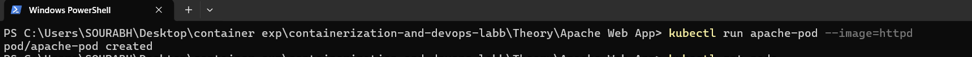
**Check** that the Pod is running:

```bash
kubectl get pods
```
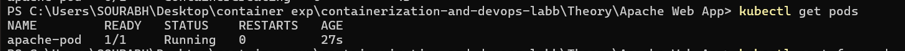

> **Expected Output:** The `apache-pod` should appear with status `Running`.

---

### Step 2: Inspect the Pod

Get detailed information about the Pod:

```bash
kubectl describe pod apache-pod
```
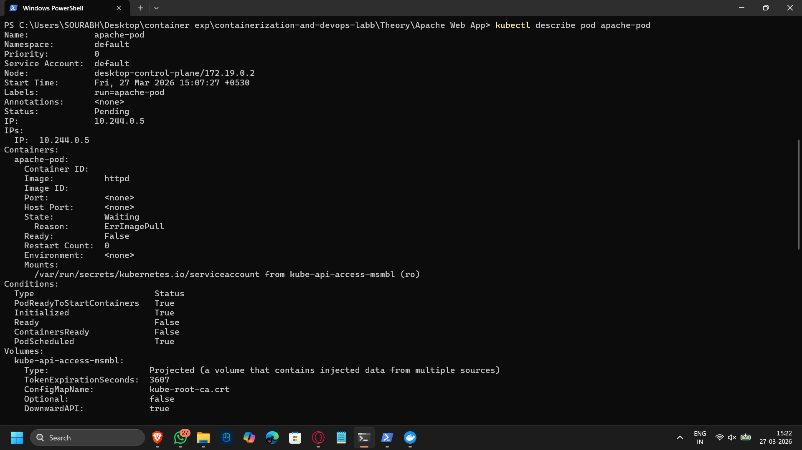
**Focus on:**
- `container image` = `httpd`
- `ports` (default: 80)
- `events` section for any errors

---

### Step 3: Access the App

Forward local port `8081` to the Pod's port `80`:

```bash
kubectl port-forward pod/apache-pod 8081:80
```
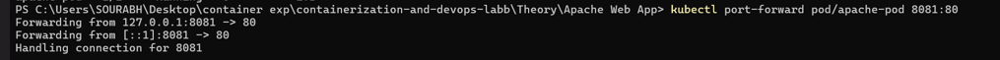
Open your browser and navigate to:

```
http://localhost:8081
```
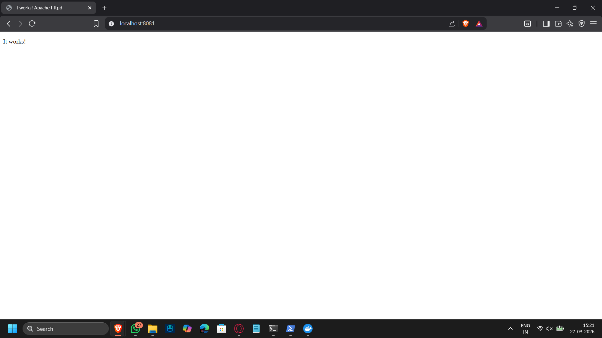

> **Expected Result:** Apache default page displaying **"It works!"**

---

### Step 4: Delete the Pod

```bash
kubectl delete pod apache-pod
```
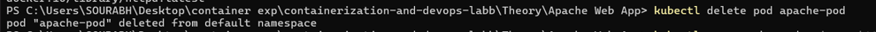

> **Insight:** The Pod disappears **permanently** — there is no self-healing. If the Pod dies, it stays dead.

---

## Task 2: Convert to Deployment

### Step 5: Create a Deployment

```bash
kubectl create deployment apache --image=httpd
```
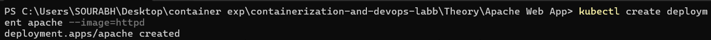
**Check** the deployment and its Pods:

```bash
kubectl get deployments
kubectl get pods
```
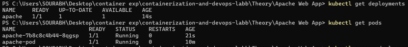
---

### Step 6: Expose the Deployment

Create a Service to expose the deployment:

```bash
kubectl expose deployment apache --port=80 --type=NodePort
```
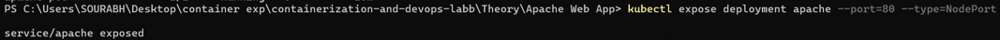
Access it via port-forward:

```bash
kubectl port-forward service/apache 8082:80
```
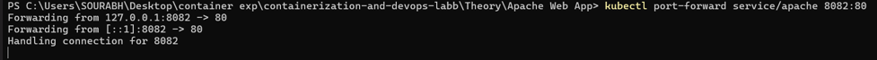
Open your browser:

```
http://localhost:8082
```

> **Expected Result:** Apache default page — same as before, but now served through a **Service** (better abstraction than direct Pod access).

---

## Task 3: Modify Behavior

### Step 7: Scale the Deployment

Scale the deployment to 2 replicas:

```bash
kubectl scale deployment apache --replicas=2
```
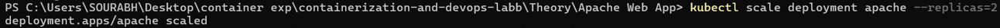
**Check** that multiple Pods are running:

```bash
kubectl get pods
```
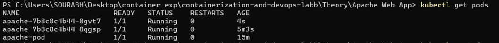
> **Observe:** Two Pods are now running the same Apache server.

---


## Task 4: Debugging Scenario

### Step 9: Break the App Intentionally

Set a wrong image to simulate a deployment failure:

```bash
kubectl set image deployment/apache httpd=wrongimage
```
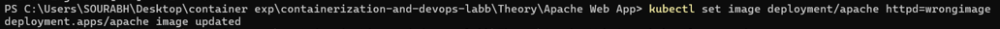
**Check** Pod status:

```bash
kubectl get pods
```
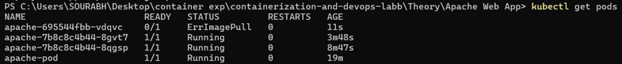
> **Expected:** You will see Pods in a broken state (e.g., `ImagePullBackOff` or `ErrImagePull`).

---

### Step 10: Diagnose the Issue

Describe the broken Pod to find error details:

```bash
kubectl describe pod <pod-name>
```
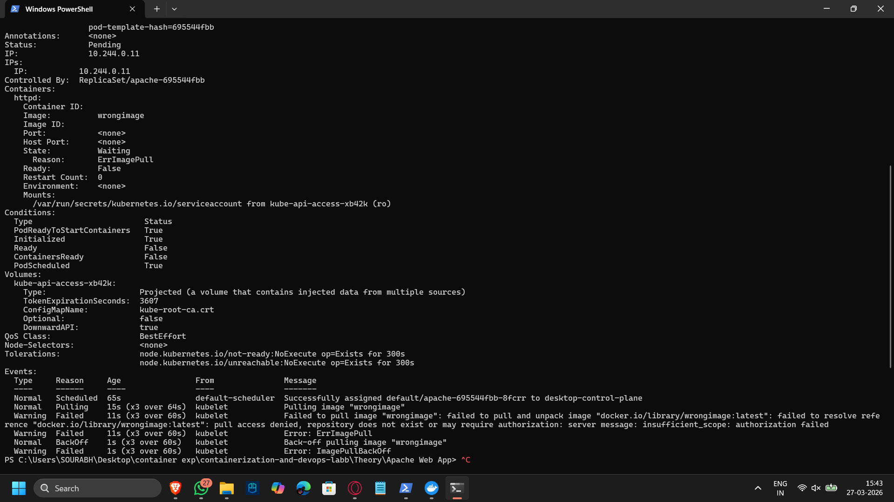

**Look for:**
- `ImagePullBackOff` status
- Error messages in the `Events` section

---

### Step 11: Fix the App

Restore the correct image:

```bash
kubectl set image deployment/apache httpd=httpd
```
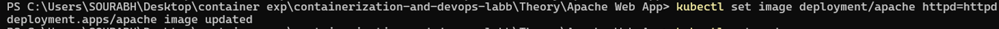
> **Verify:** Run `kubectl get pods` again — Pods should recover and show `Running`.

---

## Task 5: Explore Inside the Container

### Step 12: Exec into a Pod

Open an interactive shell inside the running container:

```bash
kubectl exec -it <pod-name> -- /bin/bash
```
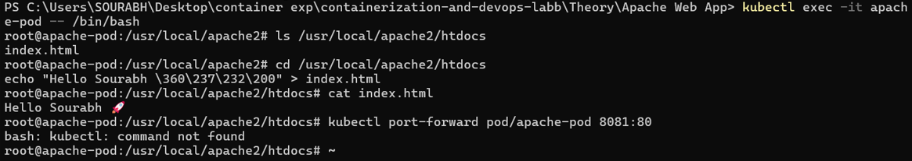
**Inside the container**, list the web files:

```bash
ls /usr/local/apache2/htdocs
```

> This directory is where Apache serves its web content from.

**Exit the container:**

```bash
exit
```

---

## Task 6: Observe Self-Healing

### Step 13: Delete One Pod

```bash
kubectl delete pod <one-pod-name>
```
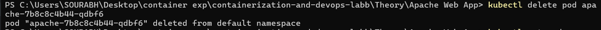
**Watch** in real-time as Kubernetes recreates the Pod automatically:

```bash
kubectl get pods -w
```
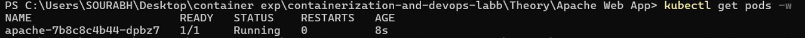
> **Insight:** The Deployment controller detects the missing Pod and immediately spins up a new one — this is **self-healing**.

---

## Task 7: Cleanup

Remove all resources created in this lab:

```bash
kubectl delete deployment apache
kubectl delete service apache
```

---

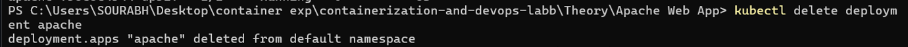
---

## Kubernetes Commands Summary

### 1. Run & Basic Pod Management

| Command | Purpose | Explanation |
|---------|---------|-------------|
| `kubectl run apache-pod --image=httpd` | Create a Pod | Runs a single Apache container directly. Quick test only. |
| `kubectl get pods` | List Pods | Shows all running Pods in current namespace. |
| `kubectl describe pod apache-pod` | Inspect Pod | Detailed info: image, ports, events, errors. |
| `kubectl delete pod apache-pod` | Delete Pod | Removes the Pod permanently (no auto-recreation). |

---

### 2. Access Application

| Command | Purpose | Explanation |
|---------|---------|-------------|
| `kubectl port-forward pod/apache-pod 8081:80` | Access Pod locally | Maps local port 8081 → Pod port 80. |
| `kubectl port-forward service/apache 8082:80` | Access Service locally | Same as above but via Service (better abstraction). |

---

### 3. Deployment Management (Recommended Approach)

| Command | Purpose | Explanation |
|---------|---------|-------------|
| `kubectl create deployment apache --image=httpd` | Create Deployment | Runs managed Pods with self-healing. |
| `kubectl get deployments` | List Deployments | Shows running deployments. |
| `kubectl expose deployment apache --port=80 --type=NodePort` | Create Service | Exposes app so it can be accessed. |
| `kubectl delete deployment apache` | Delete Deployment | Removes deployment and its Pods. |
| `kubectl delete service apache` | Delete Service | Removes access endpoint. |

---

### 4. Scaling & Load Handling

| Command | Purpose | Explanation |
|---------|---------|-------------|
| `kubectl scale deployment apache --replicas=2` | Scale app | Runs multiple Pods for same app. |
| `kubectl get pods` | Verify scaling | Shows multiple Pods running. |

---

### 5. Debugging & Troubleshooting

| Command | Purpose | Explanation |
|---------|---------|-------------|
| `kubectl set image deployment/apache httpd=wrongimage` | Break app intentionally | Simulates failure. |
| `kubectl get pods` | Check status | Look for errors like `ImagePullBackOff`. |
| `kubectl describe pod <pod-name>` | Diagnose issue | Shows exact error messages. |
| `kubectl set image deployment/apache httpd=httpd` | Fix issue | Restores correct image. |

---

### 6. Working Inside Containers

| Command | Purpose | Explanation |
|---------|---------|-------------|
| `kubectl exec -it <pod-name> -- /bin/bash` | Enter container | Opens terminal inside container. |
| `ls /usr/local/apache2/htdocs` | View web files | Shows Apache website files. |
| `exit` | Exit container | Returns to local terminal. |

---

### 7. Self-Healing Observation

| Command | Purpose | Explanation |
|---------|---------|-------------|
| `kubectl delete pod <pod-name>` | Delete one Pod | Simulate failure. |
| `kubectl get pods -w` | Watch Pods | Live view of Pod recreation. |

---

### 8. Background Process Management (Port Forwarding)

| Command | Purpose | Explanation |
|---------|---------|-------------|
| `kubectl port-forward ... &` | Run in background | Prevents terminal blocking. |
| `jobs` | List background jobs | Shows running background tasks. |
| `ps aux \| grep port-forward` | Find process | Get process ID (PID). |
| `kill %1` | Stop job | Stops using job number. |
| `kill <PID>` | Stop process | Stops using PID. |
| `pkill -f port-forward` | Stop all | Kills all port-forward processes. |

---

### 9. Better Process Handling (DevOps Practice)

| Command | Purpose | Explanation |
|---------|---------|-------------|
| `tmux new -s pf` | Start session | Run tasks in detachable terminal. |
| `Ctrl + b, d` | Detach tmux | Leave process running safely. |
| `nohup <command> &` | Persistent background run | Runs even after terminal closes. |

---

## Key Beginner Insights

### Pod vs Deployment

| | Pod | Deployment |
|-|-----|------------|
| Recovery | ❌ No (temporary) | ✅ Yes (self-healing) |
| Use case | Quick testing | Production workloads |
| Auto-restart | ❌ No | ✅ Yes |

### Port Forwarding
- ✅ Only for **debugging**
- ❌ **Not** for real/production exposure

### Service
- ✅ Stable access point
- ✅ Required for real applications

### Scaling
- Multiple Pods = better availability & fault tolerance

### Debugging
- `kubectl describe` is your **best friend**

