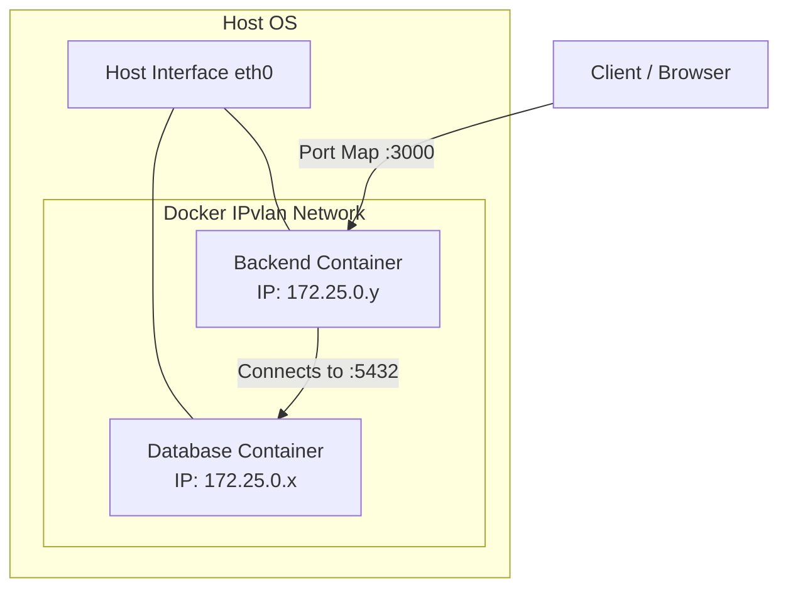

# Project Assignment 1: Containerized Web Application

## 1. Introduction
This project demonstrates the containerization and deployment of a web application utilizing a Node.js + Express backend and a PostgreSQL database. The environment uses Docker, Docker Compose for orchestration, multi-stage building techniques, and a custom IPvlan network for advanced container networking operations.

## 2. Docker Build Optimization: Multi-Stage Builds
In this project, the backend is built using **Docker multi-stage builds**. 
- **Stage 1 (Builder):** Uses the `node:18-alpine` base image, copies `package.json`, installs all dependencies (including heavy development dependencies if any exist) and compiles everything.
- **Stage 2 (Production):** Starts from a fresh `node:18-alpine` environment, bringing over *only* the finalized application artifacts and necessary production dependencies from the Builder stage.

### Why this optimization matters:
The principal advantage is the dramatic reduction of the final image size. Any intermediate files, cache from the `npm install`, and OS-level build tools are discarded. This leads to reduced storage footprint, faster deployment layers, and a smaller attack surface in production environments.

## 3. Network Design (IPvlan Architecture)
To fulfill the requirement for advanced networking, this architecture uses an **IPvlan L2 network**. 

## 4. Macvlan vs IPvlan Comparison
When choosing advanced networking drivers for Docker containers that bypass the standard Docker bridge network, the two most common advanced drivers are Macvlan and IPvlan.

| Feature | Macvlan | IPvlan (L2/L3) |
| :--- | :--- | :--- |
| **MAC Addresses** | Assigns a unique, virtual MAC address to every container. | All containers share the same underlying MAC address of the host's physical interface. |
| **Switch Compatibility** | Some physical switches or hypervisor virtual switches block multiple MAC addresses on a single port for security (Promiscuous mode required). | Works well, as switches only see a single MAC address (the host's). Bypasses switch port security restrictions. |
| **Use Case Highlight** | Great for legacy applications that expect to be directly attached to a physical network with their own distinct MAC. | Excellent for environments with strict MAC-address security or when deploying a massive number of containers (avoiding MAC-table exhaustion). |
| **Implementation here**| Due to limitations in Docker Desktop on Windows where Macvlan can struggle with the WSL2/Hyper-V internal switch, IPvlan L2 mode provides a cleaner and more reliable alternative that demonstrates the exact same networking topology knowledge (direct attachment parent interface) without MAC isolation issues. |

## 5. Artifact Proofs (Screenshots)

*Paste your screenshot showing `docker network inspect custom_ipvlan` here.*

 

*Paste your screenshot showing the specific IP assignments of the running containers here.*

 

*Paste your screenshot showing volume persistence validation (data retrieval before and after a database restart) here.*

